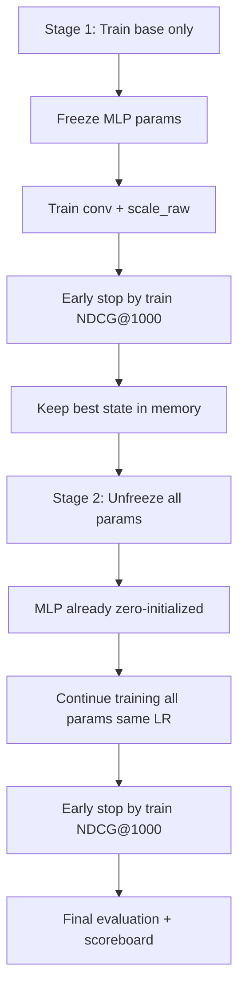

# Plan: `torch_nn_split_per_label_staged`

## Overview

A two-stage training variant of `torch_nn_split_per_label` where:
- **Stage 1**: Train only the base layers (`conv` + `scale_raw`) until early stopping
- **Stage 2**: Unfreeze all parameters (MLP starts zero-initialized) and continue training until early stopping

No intermediate checkpoint files — best model state is kept in memory.

## Proposed Name

`torch_nn_split_per_label_staged`

Model name for scoreboard: `torch_nn_split_per_label_staged(m1,m2,m3)`

## Training Flow



## Architecture Details

The model class `NNSplitPerLabelEnsembleModel` is reused unchanged. The two-stage behavior is implemented in the training loop:

### Stage 1 — Base Training

1. Freeze all parameters except `conv.weight` and `scale_raw`:
   ```python
   for name, param in model.named_parameters():
       if name not in ("conv.weight", "scale_raw"):
           param.requires_grad = False
   ```
2. Train with AdamW (LR=1e-3, weight_decay=0.01)
3. Early stopping patience=2, min_epochs=2, max_epochs=12
4. Track best state by train subset NDCG@1000
5. Print diagnostics each epoch: loss, train/test NDCG, conv weights, scale stats, delta stats

### Stage 2 — MLP Fine-tuning

1. Unfreeze all parameters:
   ```python
   for param in model.parameters():
       param.requires_grad = True
   ```
2. Reload best state from stage 1 (already in memory)
3. Reset optimizer (or keep running — same LR so no need to reset)
4. Continue training with same hyperparameters
5. Early stopping patience=2, min_epochs=2, max_epochs=12
6. Print diagnostics each epoch: loss, train/test NDCG, conv weights, scale stats, delta stats

## File Structure

New file: `benchmarks/torch_nn_split_per_label_staged.py`

### Code Structure

```
benchmarks/torch_nn_split_per_label_staged.py
  Imports (same as torch_nn_split_per_label.py)
  Constants (same defaults)
  _label_active_mask()          # copied from torch_nn_split_per_label.py
  _csr_avg_nnz_per_row()        # copied from torch_nn_split_per_label.py
  _bounded_scale_from_raw()     # copied from torch_nn_split_per_label.py
  NNSplitPerLabelEnsembleModel  # copied from torch_nn_split_per_label.py
  _delta_stats()                # copied from torch_nn_split_per_label.py
  _scale_stats()                # copied from torch_nn_split_per_label.py
  main()                        # modified: two-stage training loop
```

### Key Differences from `torch_nn_split_per_label.py`

| Aspect | `torch_nn_split_per_label.py` | `torch_nn_split_per_label_staged.py` |
|---|---|---|
| Training loop | Single loop | Two loops (stage 1 + stage 2) |
| Parameter freezing | None | Stage 1: freeze MLP; Stage 2: unfreeze all |
| Warm start | Optional `--warm-start-torch-per-label` | Not needed (stage 1 learns base from scratch) |
| `--warm-start-torch-per-label` flag | Present | Removed (or kept as optional) |
| Model name in scoreboard | `torch_nn_split_per_label(...)` | `torch_nn_split_per_label_staged(...)` |

## Training Loop Pseudocode

```python
def main():
    # ... data loading, model init (same as torch_nn_split_per_label.py) ...

    # === STAGE 1: Train base only ===
    for name, param in model.named_parameters():
        if name not in ("conv.weight", "scale_raw"):
            param.requires_grad = False

    optimizer = optim.AdamW(model.parameters(), lr=LR, weight_decay=WEIGHT_DECAY)
    criterion = nn.BCELoss()

    best_state_s1, best_epoch_s1, best_metric_s1 = train_stage(
        model, optimizer, criterion, train_loader, train_eval_loader,
        full_train_loader, test_loader, y_train_true, y_test_true,
        max_epochs=EPOCHS, patience=PATIENCE, min_epochs=MIN_EPOCHS,
        stage="stage1"
    )

    # === STAGE 2: Unfreeze all, continue training ===
    for param in model.parameters():
        param.requires_grad = True

    model.load_state_dict(best_state_s1)
    # Reset optimizer to include all params
    optimizer = optim.AdamW(model.parameters(), lr=LR, weight_decay=WEIGHT_DECAY)

    best_state_s2, best_epoch_s2, best_metric_s2 = train_stage(
        model, optimizer, criterion, train_loader, train_eval_loader,
        full_train_loader, test_loader, y_train_true, y_test_true,
        max_epochs=EPOCHS, patience=PATIENCE, min_epochs=MIN_EPOCHS,
        stage="stage2"
    )

    # ... save best from stage 2 to scoreboard ...
```

## Diagnostics Output

Each epoch prints:
- Stage number (STAGE1 / STAGE2)
- Loss
- Train subset NDCG@1000, NDCG@10
- Test NDCG@1000, NDCG@10, F1@5
- Conv weights
- Scale stats (mean, p95, max)
- Delta stats (mean abs, p95 abs)
- Elapsed time

Final summary prints:
- Stage 1 best epoch and metrics
- Stage 2 best epoch and metrics
- Final test metrics

## Implementation Notes

1. **Reuse**: Copy the entire `torch_nn_split_per_label.py` as a starting point, then modify `main()` to implement two-stage training
2. **No warm start**: Stage 1 learns the base from scratch (conv initialized from dataset weights or uniform, scale_raw initialized to zeros)
3. **Optimizer**: Can keep the same optimizer running between stages (same LR), or reset — both are valid since LR is unchanged
4. **Early stopping**: Independent counters for each stage (reset after stage 1 completes)
